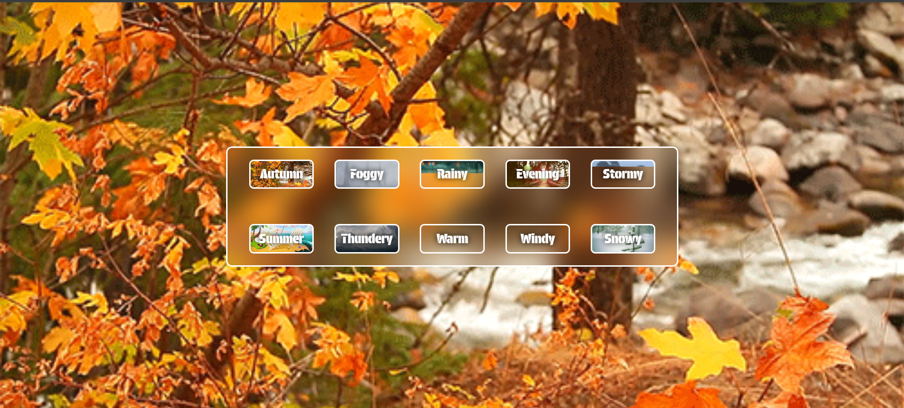
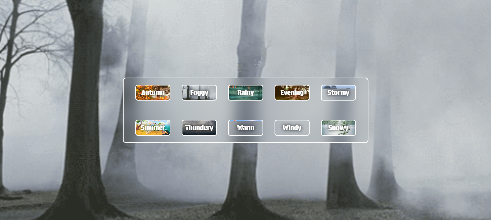
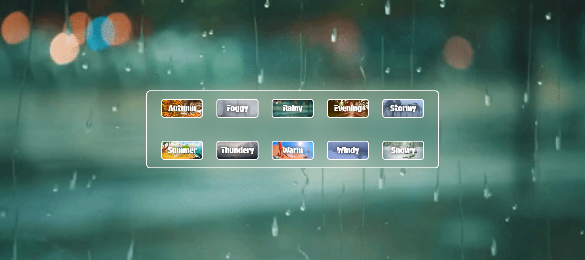
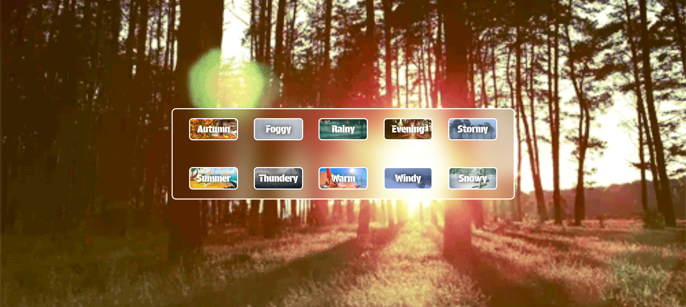
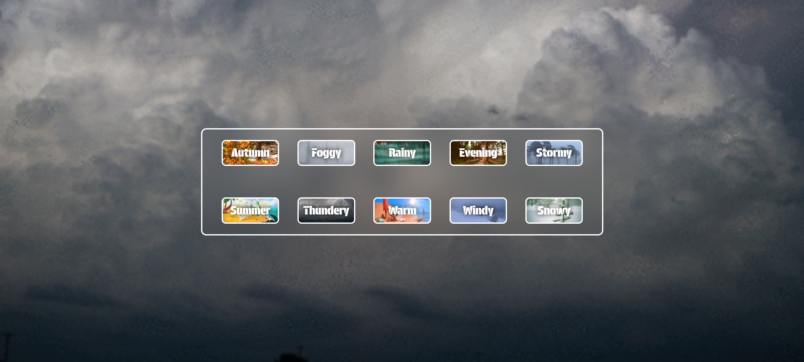
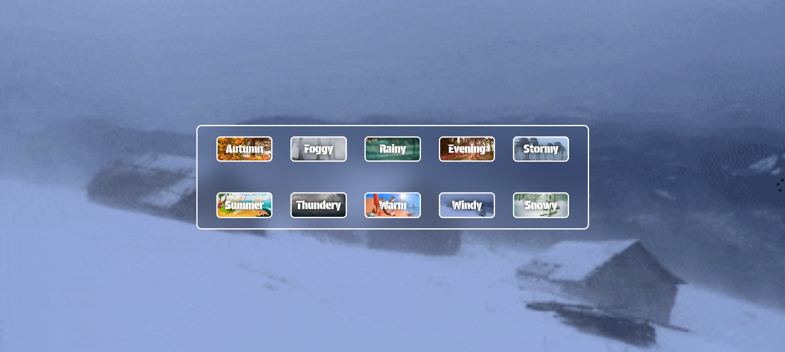

<h1 align="center" style="font-size:40px;">Weather Change Buttons</h1>
<h3 align="center">Toggling the Season Buttons to change the Environmental Conditions (Rainy, Warm, Summer etc...)</h3>

---

## 🎬 Website Demo









---

## 🧰 Tech Stack

### 💻 Frontend
- React.js
- CSS3
- JavaScript (JS)
- Vite.js

---

### Clone the repo
```bash
git clone https://github.com/nryadav18/weather-change.git
```

```bash
cd weather-change
```

### Running the Frontend
```bash
npm run dev
```
